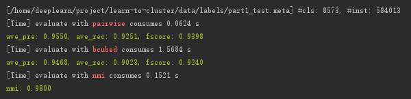

# Learning to Cluster Faces by Infomap

## Intorduction
采用了无监督方法infomap进行人脸聚类，在公开数据集上MS-Celeb-1M、YouTube-Faces、DeepFashion获得较当前主流方法(如GCN人脸聚类等监督方法)同等或更优的效果.
通过faiss加速邻接边的构建，提高聚类速度，单批百万数据聚类仅需几分钟. 效果及性能测试详见下表.

## Infomap Intorduction
[About Infomap](https://www.mapequation.org/publications.html#Rosvall-Axelsson-Bergstrom-2009-Map-equation)

## About GCN Method
1. L-GCN: [Linkage-based Face Clustering via Graph Convolution Network](https://arxiv.org/abs/1903.11306), CVPR 2019
2. GCN-D: [Learning to Cluster Faces on an Affinity Graph](https://arxiv.org/abs/1904.02749), CVPR 2019 (**Oral**)
3. GCN-V+GCN-E: [Learning to Cluster Faces via Confidence and Connectivity Estimation](https://arxiv.org/abs/2004.00445), CVPR 2020
4. GCN+LSTM: [Density-Aware Feature Embedding for Face Clustering](https://openaccess.thecvf.com/content_CVPR_2020/papers/Guo_Density-Aware_Feature_Embedding_for_Face_Clustering_CVPR_2020_paper.pdf), CVPR 2020
5. STAR-FC: [Structure-Aware Face Clustering on a Large-Scale Graph with 107 Nodes
](https://arxiv.org/pdf/2103.13225.pdf), CVPR 2021 [code](https://github.com/sstzal/STAR-FC)

## Requirements
* Python >= 3.6
* sklearn
* infomap
* numpy
* faiss-gpu(or faiss-cpu)

## Datasets
MS-Celeb-1M : part1_test (584K)、YouTube-Faces、DeepFashion

[data preparation](https://github.com/xiaoxiong74/face-cluster-by-infomap/tree/master/data/README.md)

## Run
```bash
python face-cluster-by-infomap
```

## Results on part1_test (584K)
| Method | Precision | Recall | F-score |
| ------ |:---------:|:------:|:-------:|
| Chinese Whispers (k=80, th=0.6, iters=20) | 55.49 | 52.46 | 53.93 |
| Approx Rank Order (k=80, th=0) | 99.77 | 7.2 | 13.42 |
| MiniBatchKmeans (ncluster=5000, bs=100) | 45.48 | 80.98 | 58.25 |
| KNN DBSCAN (k=80, th=0.7, eps=0.25, min=1) | 95.25 | 52.79 | 67.93 |
| FastHAC (dist=0.72, single) | 92.07 | 57.28 | 70.63 |
| [DaskSpectral](https://ml.dask.org/clustering.html#spectral-clustering) (ncluster=8573, affinity='rbf') | 78.75 | 66.59 | 72.16 |
| [CDP](https://github.com/XiaohangZhan/cdp) (single model, th=0.7)  | 80.19 | 70.47 | 75.02 |
| [L-GCN](https://github.com/yl-1993/learn-to-cluster/tree/master/lgcn) (k_at_hop=[200, 10], active_conn=10, step=0.6, maxsz=300)  | 74.38 | 83.51 | 78.68 |
| GCN-D (2 prpsls) | 95.41 | 67.77 | 79.25 |
| GCN-D (5 prpsls) | 94.62 | 72.59 | 82.15 |
| GCN-D (8 prpsls) | 94.23 | 79.69 | 86.35 |
| GCN-D (20 prplss) | 94.54 | 81.62 | 87.61 |
| GCN-D + GCN-S (2 prpsls) | 99.07 | 67.22 | 80.1 |
| GCN-D + GCN-S (5 prpsls) | 98.84 | 72.01 | 83.31 |
| GCN-D + GCN-S (8 prpsls) | 97.93 | 78.98 | 87.44 |
| GCN-D + GCN-S (20 prpsls) | 97.91 | 80.86 | 88.57 |
| GCN-V | 92.45 | 82.42 | 87.14 |
| GCN-V + GCN-E | 92.56 | 83.74 | 87.93 |
| Infomap(ours)(k=50,min_sim=0.58) | 95.50 | 92.51 | 93.98 |



## Results on YouTube-Faces

| Method | Pairwise F-score | BCubed F-score | NMI |
| ------ |:---------:|:------:|:-------:|
| Chinese Whispers (k=160, th=0.75, iters=20) | 72.9 | 70.55 | 93.25 |
| Approx Rank Order (k=200, th=0) | 76.45 | 75.45 | 94.34 |
| Kmeans (ncluster=1436) | 67.86 | 75.77 | 93.99 |
| KNN DBSCAN (k=160, th=0., eps=0.3, min=1) | 91.35 | 89.34 | 97.52 |
| FastHAC (dist=0.72, single) | 93.07 | 87.98 | 97.19 |
| GCN-D (4 prpsls) | 94.44 | 91.33 | 97.97 |
| Infomap(ours)(k=400,min_sim=0.56) | 92.82 | 91.78 | 98.04 |


## Results on DeepFashion

| Method | Pairwise F-score | BCubed F-score | NMI |
| ------ |:---------:|:------:|:-------:|
| Chinese Whispers (k=5, th=0.7, iters=20) | 31.22 | 53.25 | 89.8 |
| Approx Rank Order (k=10, th=0) | 25.04 | 52.77 | 88.71 |
| Kmeans (ncluster=3991) | 32.02 | 53.3 | 88.91 |
| KNN DBSCAN (k=4, th=0., eps=0.1, min=2) | 25.07 | 53.23 | 90.75 |
| FastHAC (dist=0.4, single) | 22.54 | 48.77 | 90.44 |
| Meanshift (bandwidth=0.5) | 31.61 | 56.73 | 89.29 |
| Spectral (ncluster=3991, affinity='rbf') | 29.6 | 47.12 | 86.95 |
| DaskSpectral (ncluster=3991, affinity='rbf') | 24.25 | 44.11 | 86.21 |
| CDP (single model, k=2, th=0.5, maxsz=200) | 28.28 | 57.83 | 90.93 |
| L-GCN (k_at_hop=[5, 5], active_conn=5, step=0.5, maxsz=50)  | 30.7 | 60.13 | 90.67 |
| GCN-D (2 prpsls) | 29.14 | 59.09 | 89.48 |
| GCN-D (8 prpsls) | 32.52 | 57.52 | 89.54 |
| GCN-D (20 prpsls) | 33.25 | 56.83 | 89.36 |
| GCN-V | 33.59 | 59.41 | 90.88 |
| GCN-V + GCN-E | 38.47 | 60.06 | 90.5 |
| Infomap(ours)(k=400,min_sim=0.88) | 38.67 | 60.48 | 90.97 |


## Time Consumes and Gpu Memory (k=50,min_sim=0.58)
| Nodes | Edges | TimeCount | Gpu Memory |
| ------ |:---------:|:---------:|:---------:|
| 500000 | 16535263 | 160(s) | 2745(MiB) |
| 1000000 | 30206572 | 400(s) | 3235(MiB) |

## Comments
* k值越大，TimeCount会变长，Gpu Memory会增加
* k值并非infomap的参数，仅为faiss构建knn构建时使用
* 数据量增加一倍，KNN构建时间为原来的4倍(实质为n*n的向量搜索)

## Feature Extraction
To experiment with your own face pictures, it is required to extracted face features from the pictures.

For training face recognition and feature extraction, you may use any frameworks below, including but not limited to:

[https://github.com/yl-1993/hfsoftmax](https://github.com/yl-1993/hfsoftmax)

[https://github.com/XiaohangZhan/face_recognition_framework](https://github.com/XiaohangZhan/face_recognition_framework)


## References
* [最小熵原理（五）：“层层递进”之社区发现与聚类](https://spaces.ac.cn/archives/7006)
* [人脸聚类主流方案](https://github.com/yl-1993/learn-to-cluster)

## Citation

```
@misc{face-cluster-by-infomap,
  title={face-cluster-by-infomap},
  author={Yongfu Xiong},
  year={2020},
  howpublished={\url{https://github.com/xiaoxiong74/face-cluster-by-infomap}},
}
```
